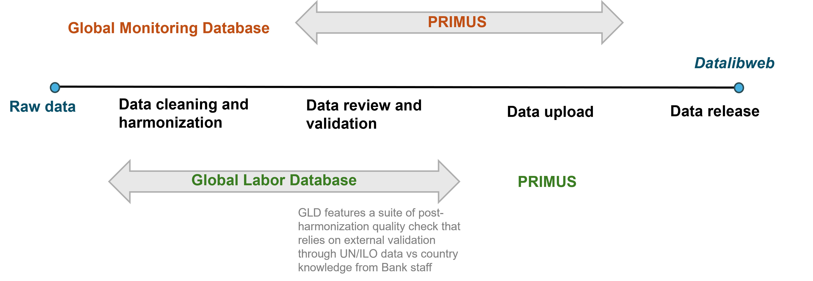

# Uploading GLD data into PRIMUS

## Motivation for Integrating the Global Labor Database (GLD) into PRIMUS

The **Global Labor Database (GLD)** is the World Bank’s flagship initiative for harmonizing labor force and household surveys with labor modules. GLD ensures transparency and reproducibility by documenting each step of the harmonization process—from raw data acquisition to the coding of harmonized variables—and by sharing codes and metadata openly through GitHub. It is both a research asset and a public good that empowers users to rely on harmonized “as-is” files or to customize the process to suit deeper analytical needs. 

Currently, **Datalibweb** acts as the front-end interface through which World Bank users download harmonized labor data from GLD using the Stata API. **PRIMUS**, on the other hand, is the institutional platform designed to ensure that data uploaded to Datalibweb meets Bank-wide clearance protocols, with roles for uploaders, approvers, and finalizers. It provides the infrastructure for version control, metadata validation, and auditability of microdata workflows.

Unlike other databases that rely on PRIMUS for multi-stage validation, all datasets in the GLD server have already undergone extensive quality checks. These include validation against external indicators (e.g., ILO, WDI), over-time consistency tests, and consultation with national statistical offices and World Bank regional staff. As such, the integration of GLD into PRIMUS is not to conduct additional validation but to use PRIMUS as a structured conduit to upload datasets to Datalibweb in accordance with institutional protocols.

This integration aligns with PRIMUS’s role as the central gateway for uploading licensed, validated data into secured cloud storage, while preserving the GLD’s core principles of openness, transparency, and user empowerment. Moreover, formalizing GLD uploads via PRIMUS increases institutional visibility, ensures traceability, and positions the GLD to scale sustainably as part of the Bank’s unified data architecture.
